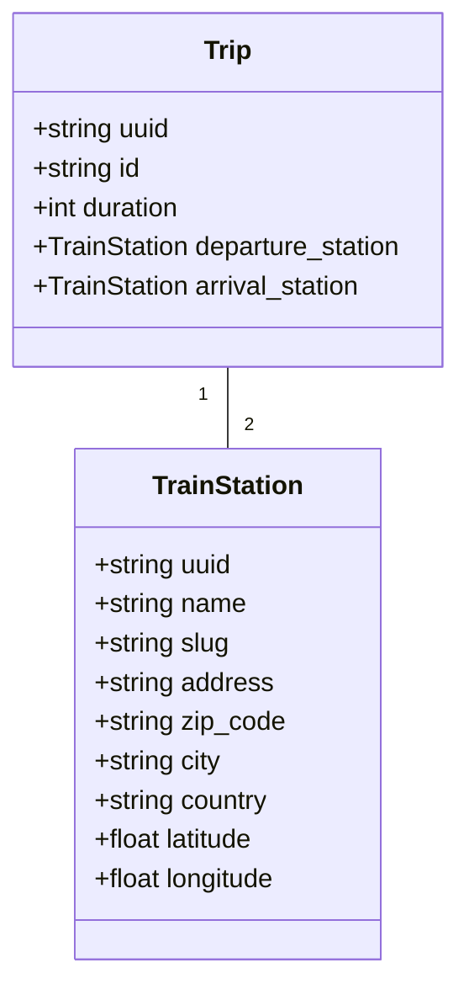

```mermaid
classDiagram
    class TrainStation {
        +string uuid
        +string name
        +string slug
        +string address
        +string zip_code
        +string city
        +string country
        +float latitude
        +float longitude
    }

    class Trip {
        +string uuid
        +string id
        +int duration
        +TrainStation departure_station
        +TrainStation arrival_station
    }

    Trip "1" -- "2" TrainStation
```
